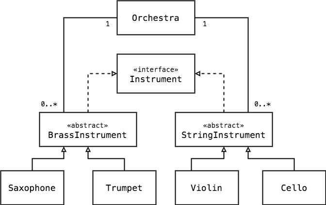

# Requirement
*This system will represent several types of instruments that could be used in an orchestra.
*Create the project, and implement the class hierarchy, relationships and associations present in the class diagram below

*Create any packages, classes, and interfaces that you might need, and carefully consider the types of any fields you might want to implement. 
