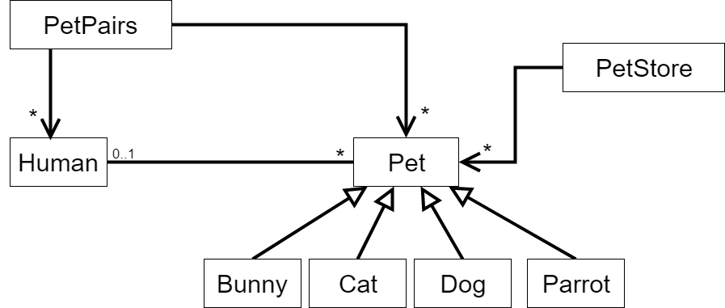

# Requirement
In PetPairs, humans search for pets based on species and color.
If humans have accumulated enough points to afford a given pet, the two can adopt each other and ‘pair up’. 
Note that this adoption is mutual: that is, pets can also adopt a human!  

    <>

