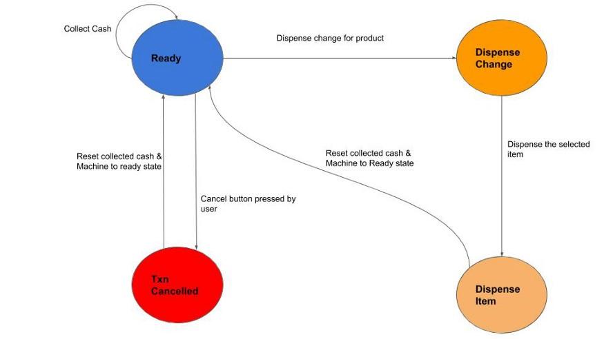

# Requirement:

Problem Statement
You need to design a Vending Machine which
 1. Vending Machine must keep track of the inventory
 2. A person should be able to insert cash into the machine & choose an item
 3. The Machine should confirm the inserted cash with the price of the selected item
 4. The machine must display an error in case of insufficient cash or unavailable item
 5.Finally, if all the above steps succeed then the user gets the selected item

Design :
Ready — Machine ready to accept cash

CashCollected — Machine has collected cash & user can now select the product or cancel the transaction

DispenseChange — Give back the change to the user

DispenseItem — Dispense the item upon successful validation of entered cash & the price of the selected item in inventory

TransactionCancelled — If the user cancels the transaction, return the cash given by the user

